## :wrench: Instalação Home Assistant - Proxmox

1 - Faça o Download do Home Assistant OS na versão `.qcow2` [KVM/Proxmox](#https://www.home-assistant.io/installation/alternative)

Requisitos mínimos:
* 2GB RAM
* 32GB Disco
* 2vCPU

2 - Extraia o arquivo `.qcow2` presente no arquivo `.xz`, altere a extersão para `.img` e envie para o servidor Proxmox.

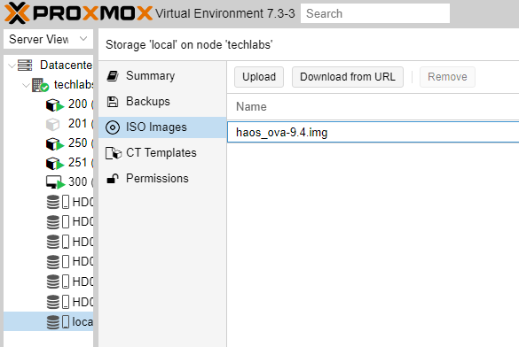

3 - Crie uma VM com os seguintes parâmetros:

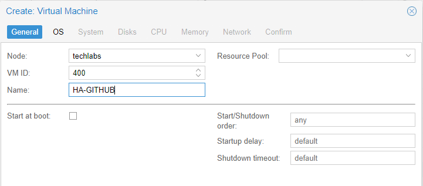

* **OS:** Do not use any media.

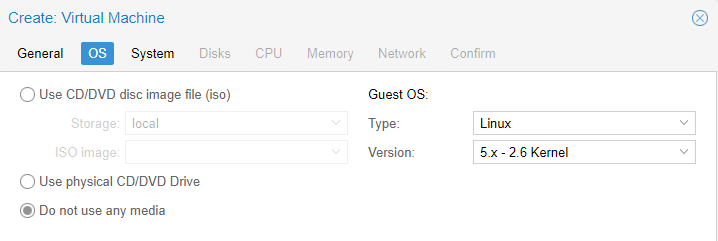

* **System:** Selecione a caixa Qemu Agent.

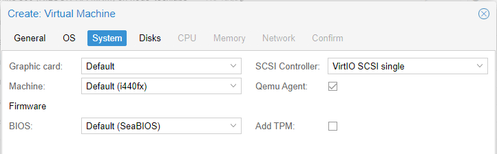

* **Disk:** Clique na lixeira, para excluir o disco scsi0.

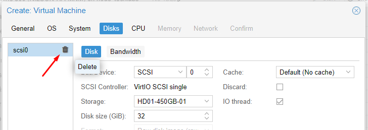

* **CPU:** 1 Sockets / 2 Cores

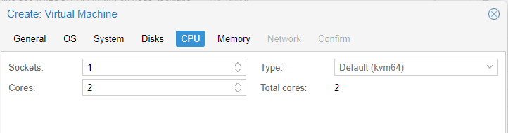

* **Memory:** 4096

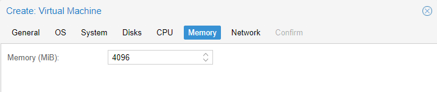

* **Network: Ajuste conforme a sua rede.**

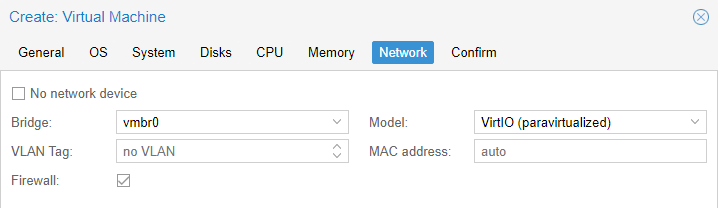

* **Confirm:** Start after created **(não marque essa opção)**

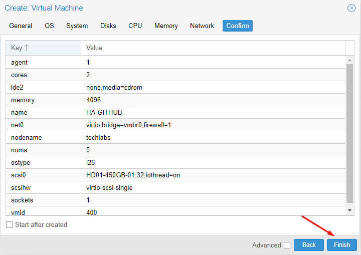

4 - Abra o console do Proxmox e importe a img para a VM

* cd /var/lib/vz/template/iso

* qm importdisk VMID /var/lib/vz/template/iso/haos_ova-9.4.img STORAGE_LOCATION

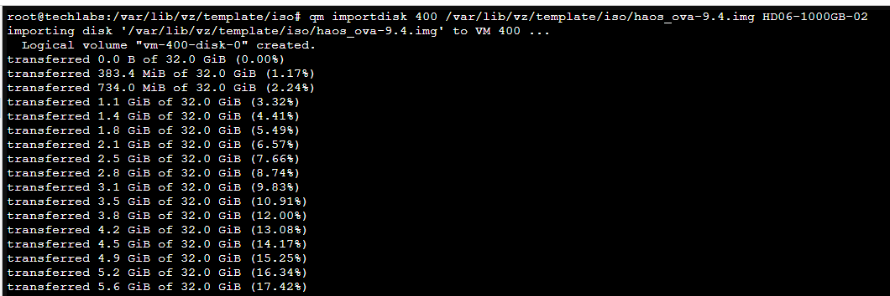
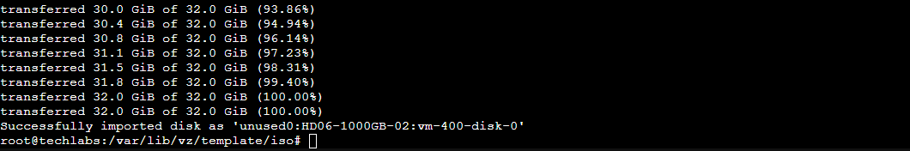

5 - Selecione a VM > Hardware

* Unused Disk 0 > ADD

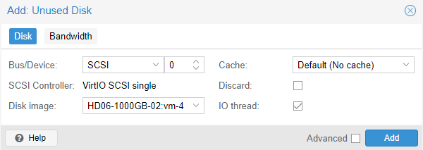

* ADD > EFI Disk: Selecione o disco da VM e desmarque Pre-Enroll Keys

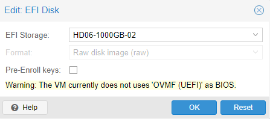

* Bios: OVMF (UEFI)

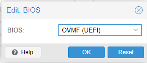

6 - Selecione a VM > Options

* Boot Order: Mantém apenas a versão **scsi0**

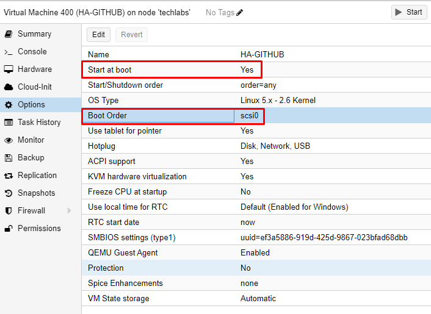

7 - Start VM

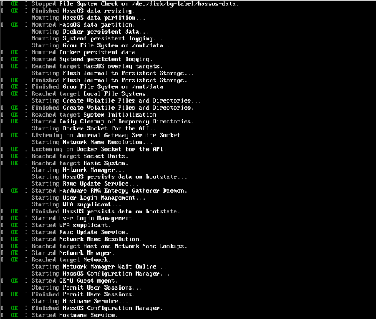

---

## :sparkling_heart: Nos Ajude a Crescer
>Se este Material foi útil para você, ajude se inscrevendo no meu canal do YouTube.
>
>(https://youtube.com/techlabs94?sub_confirmation=1)
>
>Isso me incentiva a trazer mais materiais como este e muitos outros de redes e tecnologia.
>
>## 

## :iphone: Contato e Informações

